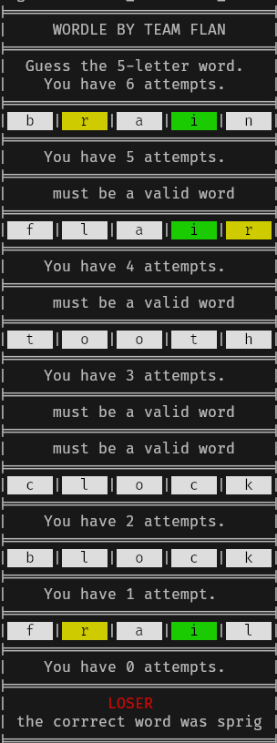
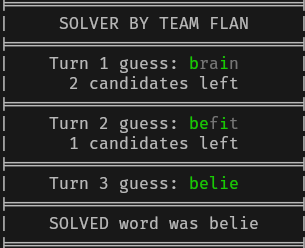

# Worlde in C
## this is the Project For Algo L2 ISIL C

this project is divided into 3 parts:
### Wordle
which is the logic of the game
### Wordle UI
which is the UI for the user to interact with the game
### Solver
an algorithm that automatically tries to solve the game

## screenshots
### Wordle

### Solver

## Credits
- [PigeonCoding](https://github.com/PigeonCoding/) (Messaoudi Wassim)
- [D-Falco](https://github.com/D-Falco) (Mahdi Mohamed Nazim)
- [mahio323](https://github.com/mahio323) (Boudraf Mohyiddine Ibrahim)
